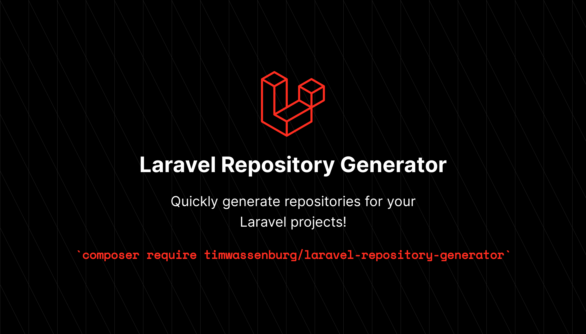

[](https://packagist.org/packages/timwassenburg/laravel-repository-generator)
[](https://github.com/timwassenburg/laravel-repository-generator/actions?query=workflow%3Arun-tests+branch%3Amaster)
[](https://packagist.org/packages/timwassenburg/laravel-repository-generator)
[](https://packagist.org/packages/timwassenburg/laravel-repository-generator)

<hr>

## Table of Contents
  <ol>
    <li><a href="#features">Features</a></li>
    <li>
        <a href="#getting-started">Getting started</a>
        <ul>
            <li><a href="#installation">Installation</a></li>
            <li><a href="#publish-config-(optional)">Publish config (optional)</a></li>
        </ul>
    </li>
    <li>
      <a href="#usage">Usage</a>
      <ul>
        <li><a href="#generating-repositories">Generating repositories</a></li>
        <li><a href="#dependency-injection">Dependency Injection</a></li>
      </ul>
    </li>
    <li><a href="#manual-binding">Manual binding</a></li>
    <li><a href="#testing">Testing</a></li>
    <li><a href="#more-generator-packages">More generator packages</a></li>
    <li><a href="#contributing">Contributing</a></li>
    <li><a href="#license">License</a></li>
  </ol>

## Features
With this package you can generate repositories with the ```artisan make:repository``` command. 
The generator will generate the repository, repository interface and will bind them automatically (can be changed to 
manual binding) to the Service Container so you can inject the interface into your controllers.

## Installation
Require the Laravel Repository Generator with composer.
```bash
composer require timwassenburg/laravel-repository-generator --dev
```

### Publish config (optional)
```bash
php artisan vendor:publish --provider="TimWassenburg\RepositoryGenerator\RepositoryGeneratorServiceProvider" --tag="config"
```

## Usage
For usage take the following steps. Generate the repository and then inject it into a controller or service.

### Generating repositories
Run the following command.
```bash
php artisan make:repository UserRepository
```
This example will generate the following files:
```bash
app\Repositories\Eloquent\UserRepository
app\Repositories\UserRepositoryInterface
```

### Dependency Injection
Next we have to inject the interface into the constructor our controller or service. For this example we will use the UserController.
```php
<?php

namespace App\Http\Controllers;

use App\Repositories\UserRepositoryInterface;

class UserController extends Controller
{
    private $user;

    public function __construct(UserRepositoryInterface $userRepository)
    {
        $this->user = $userRepository;
    }
    
    // your controller functions
}
```

By default you will be able to use Eloquent methods like ```all()``` and ```find()```.
You can extend this in your repository. Now you will be able to use your repository 
in your methods like this.
```php
public function index()
{
    return $this->user->all();
}
```
## Manual binding
By default the package will automatically bind the repository interfaces for you with the repositories so you can
inject the interface into your controllers. If you want to bind manually you can disable
this behaviour by setting the ```auto_bind_interfaces``` option to ```false``` in ```config\repository-generator.php```.
If the config is not there make sure to publish it first as described in the Installation chapter.

You can add your bindings to your AppServiceProvider or 
you can a create a new provider with ```php artisan make:provider RepositoryServiceProvider```
(don't forget to add it in ```config\app.php```) and add the bindings in the ```register()``` method, see the example below.

```php
<?php 

namespace App\Providers; 

use App\Repositories\Eloquent\UserRepository;
use App\Repositories\UserRepositoryInterface;
use Illuminate\Support\ServiceProvider; 

/** 
* Class RepositoryServiceProvider 
* @package App\Providers 
*/ 
class RepositoryServiceProvider extends ServiceProvider 
{ 
   /** 
    * Register services. 
    * 
    * @return void  
    */ 
   public function register() 
   { 
       $this->app->bind(UserRepositoryInterface::class, UserRepository::class);
   }
}
```

## Testing

Run the tests with:

```bash
composer test
```

## More generator packages

Looking for more ways to speed up your workflow? Make sure to check out these packages.

- [Laravel Action Generator](https://github.com/timwassenburg/laravel-action-generator)
- [Laravel Pivot Table Generator](https://github.com/timwassenburg/laravel-pivot-table-generator)
- [Laravel Repository Generator](https://github.com/timwassenburg/laravel-repository-generator)
- [Laravel Service Generator](https://github.com/timwassenburg/laravel-service-generator)
- [Laravel Trait Generator](https://github.com/timwassenburg/laravel-trait-generator)

The packages mentioned above are part of [Laravel Artisan Extender](https://github.com/timwassenburg/laravel-artisan-extender).

## Contributing
Contributions are what make the open source community such an amazing place to learn, inspire, and create. Any contributions you make are **greatly appreciated**.

If you have a suggestion that would make this better, please fork the repo and create a pull request. You can also simply open an issue with the tag "enhancement".
Don't forget to give the project a star! Thanks again!

1. Fork the Project
2. Create your Feature Branch (`git checkout -b feature/AmazingFeature`)
3. Commit your Changes (`git commit -m 'Add some AmazingFeature'`)
4. Push to the Branch (`git push origin feature/AmazingFeature`)
5. Open a Pull Request

## License
The MIT License (MIT). Please see [License File](LICENSE.md) for more information.
